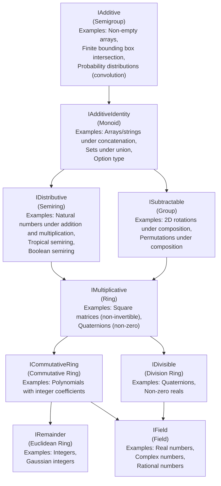

# SP #021: Abstract Algebra Interface Hierarchy

This proposal introduces a hierarchy of algebraic structure interfaces in
Slang, providing a foundation for principled generic mathematical operations.

## Status

Status: Design Review

Implementation: N/A

Author: Ellie Hermaszewska

Reviewer: TBD

## Background

Currently, Slang lacks a formal way to express algebraic properties of types.
While basic arithmetic operations are supported, there's no standard vocabulary
to express a type's conformance to algebraic laws. This is particularly
relevant for graphics programming where we frequently work with a variety of
mathematical objects, each fulfilling different properties described by
abstract algebra, for example:

- Vector spaces
- Quaternions
- Dual numbers
- Matrices
- Complex numbers

Additionally, many types support only a subset of arithmetic operations. For example:

- Strings support concatenation (forming a monoid (an additive identity
  structure)) but not subtraction
- Colors support addition and scalar multiplication but not division
- Matrices support multiplication but aren't always invertible
- Non-empty containers support concatenation (forming a semigroup)
  but lack an identity element

A single catch-all "Arithmetic" interface would be insufficient as it would
force types to implement operations that don't make mathematical sense.

A formal interface hierarchy allows us to:

- Write generic code that works across multiple numeric types
- Clearly document mathematical properties
- Avoid forcing inappropriate operations on types

## Related Work

- Haskell: Extensive typeclass hierarchy (Semigroup, Monoid)
  - Haskell does have a catch-all `Num` class, which is largely considered a
    misfeature, and several third-party packages exist to rectify this with a
    more nuanced abstract algebra hierarchy
- PureScript: Similar to Haskell but with stricter adherence to category theory
  principles
- Rust: Traits for arithmetic operations (Add, Mul)
- Scala: Abstract algebra typeclasses in libraries like Spire

## Proposed Approach

Implement the following interfaces, replacing in part `__BuiltinArithmeticType`:

```slang
// IAdditive represents a semigroup - a set with an associative binary operation
// Properties: (a + b) + c = a + (b + c)
// Examples: Non-empty arrays, Finite bounding box intersection, Probability distributions (convolution)
interface IAdditive
{
    static This operator+(This a, This b);  // Associative addition
};

// IAdditiveIdentity represents a monoid - a semigroup with an identity element
// Properties: zero() + a = a + zero() = a
// Examples: Arrays/strings under concatenation, Sets under union, Option type
interface IAdditiveIdentity : IAdditive
{
    static This zero();  // Additive identity
};

// ISubtractable represents a group - a monoid with inverse elements
// Properties: a + (-a) = (-a) + a = zero()
// Examples: 2d rotations under composition, permutations under composition
interface ISubtractable : IAdditiveIdentity
{
    static This operator-(This t);  // Additive inverse
    static This operator-(This a, This b);
};

// IDistributive combines additive monoid with multiplicative monoid to form a semiring.
// Properties: Multiplication distributes over addition
// (a + b) * c = (a * c) + (b * c)
// c * (a + b) = (c * a) + (c * b)
// one() * a = a * one() = a
// Examples: Natural numbers under addition and multiplication, Tropical semiring, Boolean semiring
interface IDistributive : IAdditiveIdentity
{
    static This operator*(This a, This b); // Multiplicative operation
    static This one(); // Multiplicative identity
};

// IMultiplicative combines semiring with additive group to form a ring.
// Properties: All semiring properties plus additive inverses, multiplication
// may not be commutative.
// Examples: Square matrices (non-invertible), Quaternions (non-zero)
interface IMultiplicative : IDistributive, ISubtractable
{
};

// ICommutativeRing represents a ring where multiplication is commutative.
// Properties: a * b = b * a
// Examples: Polynomials with integer coefficients
interface ICommutativeRing : IMultiplicative
{
    // Enforces a * b = b * a
};

// IDivisible adds multiplicative inverses to a ring to form a division ring.
// Properties: x * recip(x) = recip(x) * x = one()
// Examples: Quaternions, non-zero reals
interface IDivisible : IMultiplicative
{
    static This recip(This x);  // Multiplicative inverse
    static This operator/(This a, This b);  // Division
};

// IRemainder adds Euclidean division properties to a commutative ring.
// Properties: a = (a / b) * b + (a % b) where norm(a % b) < norm(b)
// Examples: Integers, Gaussian integers
interface IRemainder : ICommutativeRing
{
    static This operator%(This a, This b);  // Remainder
    static uint norm(This a);          // Absolute value for remainder comparison
};

// IField represents a commutative ring where every non-zero element has a multiplicative inverse.
// Properties: All commutative ring properties plus multiplicative inverses
// Examples: Real numbers, Complex numbers, Rational numbers
interface IField : ICommutativeRing, IDivisible
{
};
```



Additionally the following interfaces extend `IField` to add support for
hyperbolic and trigonometric operations.

```slang
interface ITrigonometric : IField
{
    static This pi();
    static This sin(This angle);
    static This cos(This angle);
    static This tan(This angle);
    static This asin(This value);
    static This acos(This value);
    static This atan(This value);
    static This atan2(This y, This x);
}

interface IHyperbolic : IField
{
    static This e();
    static This sinh(This value);
    static This cosh(This value);
    static This tanh(This value);
    static This asinh(This value);
    static This acosh(This value);
    static This atanh(This value);
}

interface IExponential : IField
{
    static This exp(This x);
    static This log(This x);   // Natural logarithm, base e
    static This log10(This x); // Base-10 logarithm
}
```

## Machine values

```slang
interface IEEE754Float : ITrigonometric, IHyperbolic, IExponential
{
    // IEEE754-specific constants
    static This positiveInfinity(); // Returns the IEEE754 +∞
    static This negativeInfinity(); // Returns the IEEE754 -∞
    static This nan();              // Returns a NaN (Not-a-Number) value
    static This epsilon();          // Returns the smallest difference such that 1 + epsilon != 1

    // Classification functions
    static bool isNaN(This x);      // Returns true if x is NaN
    static bool isInfinite(This x); // Returns true if x is positive or negative infinity
    static bool isFinite(This x);   // Returns true if x is finite (not infinity or NaN)

    // Rounding operations
    static This floor(This x);      // Returns the largest integer not greater than x
    static This ceil(This x);       // Returns the smallest integer not less than x
    static This round(This x);      // Rounds x to the nearest integer
    static This trunc(This x);      // Truncates x, discarding the fractional part
};
```

## Implementation notes

Part of the scope of this work is to determine how close to this design we can
achieve and not break backwards compatibility. Or, what elements of backwards
compatibility we are willing to compromise on if any.

## Interface Rationale

Each interface has specific types that satisfy it but not more specialized
interfaces. A selection of non-normative examples:

- IAdditive: Non-empty arrays/buffers under concatenation (no identity element)
- IAdditiveIdentity: Strings under concatenation (no inverse operation)
- ISubtractable: Square matrices under addition (multiplication isn't
  distributive)
- IDistributive: Boolean algebra (no additive inverses)
- IMultiplicative: Square matrices under standard operations (multiplication
  isn't commutative)
- ICommutativeRing: Dual numbers (no general multiplicative inverse)
- IRemainder: Integers (no multiplicative inverse)
- IDivisible: Quaternions (multiplication isn't commutative)
- IField: Complex numbers, Real numbers (satisfy all field axioms)

## Floating Point Considerations

The algebraic laws described must account for floating point arithmetic
limitations:

- Associativity is not exact: `(a + b) + c ≠ a + (b + c)` for some values
- Distributivity has rounding errors: `a * (b + c) ≠ (a * b) + (a * c)`

Therefore, implementations should:

- Consider operations "lawful" if they're within acceptable epsilon
- Document precision guarantees
- Consider NaN and Inf as special cases

## Operator Precedence

All operators maintain their existing precedence rules. For example:

```slang
a + b * c  // equivalent to a + (b * c)
```

## Literal Conversion Interfaces

```slang
// Types that can be constructed from integer literals
interface FromInt
{
    static T fromInt(int value);
};

// Types that can be constructed from floating point literals
interface FromFloat
{
    static T fromFloat(float value);
};
```

Design choices still TBD:

- Handling of integer literals that exceed the target type's range
- Treatment of unsigned integer literals
- Conversion of double precision literals to single precision types
- Error reporting mechanisms for out-of-range values
- Whether to provide separate interfaces for different integer types (int32, uint32, etc.)

## Generic Programming

This hierarchy enables generic algorithms that work with any type satisfying
specific algebraic properties:

```slang
// Generic linear interpolation for any IField
T lerp<T : IField>(T a, T b, T t)
{
    return a * (T.one() - t) + b * t;
}

// Generic accumulation for any IAdditiveIdentity
T sum<T : IAdditiveIdentity>(T[] elements)
{
    T result = T.zero();
    for(T elem in elements)
        result = result + elem;
    return result;
}

// Generic matrix multiplication
matrix<T, N, P> mul<T : IMultiplicative, let N : int, let M : int, let P : int>(
    a : matrix<T, N, M>,
    b : matrix<T, M, P>
)
{
    // Implementation using only IMultiplicative operations
}

// Generic geometric transforms
Transform<T : IMultiplicative> compose<T>(Transform<T> a, Transform<T> b)
{
    // Implementation using IMultiplicative operations
}
```

## Alternatives Considered

### More nuanced hierarchy

We could go further and introduce additional interfaces below `IAdditive`,
which could be used for example for some color mixing operations. However, this
has a major downside in that it defies programmer intuition that the `+`
operator is associative.

### Operator Overloading Only

We could rely solely on operator overloading without formal interfaces.
Rejected because:

- Lawless, hard to reason about code
- Less clear documentation of mathematical properties
- Harder to write generic code with specific algebraic requirements

### Leave this to a third party library

These operations describe very fundamental aspects of the language, leaving
this to a third party library would risk incompatible interfaces arising. We
also have many higher level constructs already in the standard library which
will need to built upon some algebraic hierarchy.

### Alternative: Heterogeneous Operation Types

Similar to Rust's approach, we could allow operations to return different types
than their inputs:

```slang
interface Add<RHS>
{
    associatedtype Output;
    Output operator+(This, RHS);
}
```

This would enable operations like:

```slang
extension matrix<float, 3, 3> : Mul<float3>
{
    associatedtype Output = float3;
    Output operator*(This a, Vector3 b) { /* ... */ }
}

extension float : Add<float>
{
    associatedtype Output = float3;
    Output operator+(This a, float b) { /* ... */ }
}
```

This comes with some downsides however:

- Non-injective type families (where multiple input type combinations could
  produce the same output type) may lead to worse type inference
- This flexibility, while powerful, introduces potential confusion about
  operation semantics
- Most mathematical structures in abstract algebra assume operations are closed
- The rare cases where heterogeneous operations are needed can be served by
  explicit conversion functions or dedicated methods. This can also be served by
  implicit conversions

The benefits of simpler type inference and clearer algebraic semantics outweigh
the flexibility of heterogeneous operations.

## Future Extensions

Several potential extensions could enhance this algebraic hierarchy:

- Vector Space Interface

  - Add dedicated interfaces for vector spaces over fields
  - Include operations for scalar multiplication and inner products
  - Support for normed vector spaces

- Ordered Algebraic Structures

  - Introduce interfaces for ordered rings and fields
  - Support comparison operators (<, >, <=, >=)
  - Enable generic sorting and optimization algorithms

- Lattice Structures

  - Add interfaces for lattices and boolean algebras
  - Support min/max operations
  - Enable interval arithmetic

- Module Interface

  - Support for modules over rings
  - Generalize vector space concepts
  - Enable more generic linear algebra operations

- Error Handling Extensions
  - Refined error types for algebraic operations
  - Optional bounds checking interfaces
  - Overflow behavior specifications
