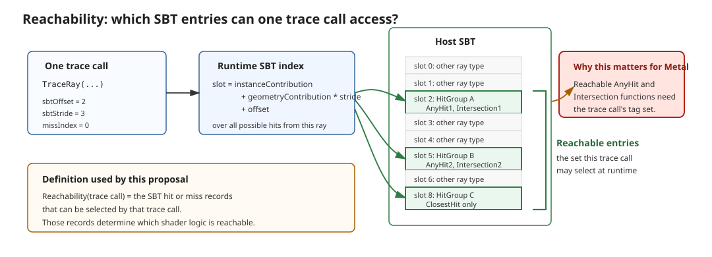
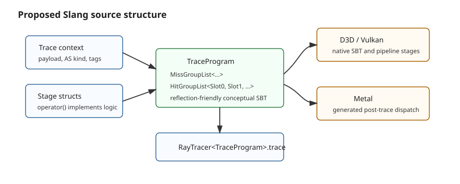
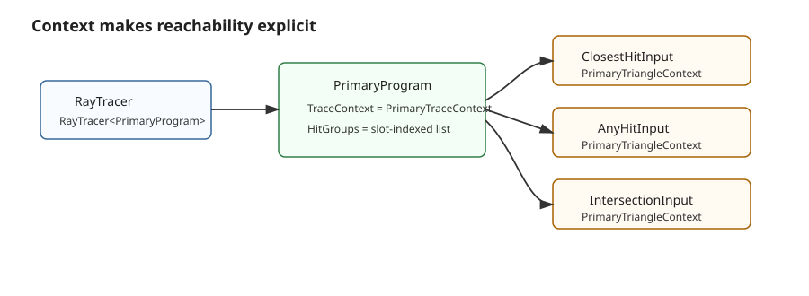

SP #041: Pipeline Ray Tracing API Structural Dispatch
=====================================================

This proposal sketches a new Slang ray tracing API that treats Metal as a first-class target
while preserving the D3D and Vulkan pipeline model. The central idea is to make the shader source
declare a conceptual shader binding table, or SBT, as structured Slang types. D3D and Vulkan can
continue to use the native host-created SBT. Metal can use the same structure to synthesize the
post-trace closest-hit and miss dispatch logic that Metal programmers normally write by hand.

Status
------

Status: Draft Proposal.

Author:

Reviewer:

Scope
-----

Scope: pipeline ray tracing only. Inline ray tracing and ray queries are intentionally out of
scope for this first design.

Catalog
-------

- [1. Challenges Extending Current Slang Ray Tracing To Metal](#1-challenges-extending-current-slang-ray-tracing-to-metal)
  - [1.1 Dispatch Model Gap](#11-dispatch-model-gap)
  - [1.2 Metal Tag List And Reachability](#12-metal-tag-list-and-reachability)
  - [1.3 Reserved Challenges](#13-reserved-challenges)
- [2. Proposed API Sketch](#2-proposed-api-sketch)
  - [2.1 Overview](#21-overview)
  - [2.2 Detailed Component Descriptions](#22-detailed-component-descriptions)
  - [2.3 Writing Stages As Interface-Conforming Types](#23-writing-stages-as-interface-conforming-types)
- [3. Migration Examples](#3-migration-examples)
  - [3.1 Migrating Existing Metal Code To The New API](#31-migrating-existing-metal-code-to-the-new-api)
  - [3.2 Migrating Existing Slang D3D/Vulkan Ray Tracing Code](#32-migrating-existing-slang-d3dvulkan-ray-tracing-code)
  - [3.3 Host Reflection Patterns](#33-host-reflection-patterns)
- [4. Open Design Questions](#4-open-design-questions)

## 1. Challenges Extending Current Slang Ray Tracing To Metal

### 1.1 Dispatch Model Gap

D3D and Vulkan expose ray tracing as a pipeline-stage model. A trace call enters traversal, and
the driver or hardware uses host-created SBT records to select miss, any-hit, intersection, and
closest-hit shaders. The closest-hit function is not directly called from ray-generation source.

Metal exposes a different model. `intersector.intersect(...)` returns an `intersection_result`.
AnyHit and custom Intersection behavior can still be dispatched during traversal through Metal's
function table or function buffer, but Miss and ClosestHit are ordinary post-trace shader logic
written by the user.

Figure 1 shows the key mismatch: D3D/Vulkan assign stage dispatch to the host SBT and the
driver/hardware, while Metal assigns Miss and ClosestHit dispatch to shader code after
`intersect(...)` returns. A portable Slang API needs enough structure to synthesize that Metal
post-trace dispatch without changing the native D3D/Vulkan model.

<a id="fig-dispatch-model-gap"></a>


*Figure 1. Dispatch model gap: D3D and Vulkan select pipeline stages through host-created SBT records, while Metal requires user-written post-trace dispatch for Miss and ClosestHit.*

### 1.2 Metal Tag List And Reachability

This proposal uses the term **reachability** to describe the shader binding table entries that a
single trace call can access. The trace call supplies dispatch parameters, traversal contributes
geometry and instance information, and the target selects one of the SBT records. Those selectable
records are the entries reachable from that trace call.

In existing D3D/Vulkan-style ray tracing models, this reachability is determined by host-created
binding data. The shader source contains the trace call, but the SBT records and the binding edges
from those records to AnyHit, Intersection, ClosestHit, and Miss shaders are provided by host code.
Therefore, as shown in Figure 2, the complete reachability set is not known from shader source at
ordinary compile time.

<a id="fig-reachability-definition"></a>


*Figure 2. Reachability definition: the reachable entries are the SBT records one trace call can select at runtime, but in the existing model that set is determined by host-created binding data.*

Metal adds a second constraint: each custom intersection function reachable from an intersector
must have a compatible `[[intersection(...)]]` tag list. Native Metal can validate a mismatch at
pipeline build time because the user writes both the intersector tags and the function tags in
source. Figure 3 shows why this works: pipeline build sees the intersector tags, function tags,
and host bindings together.

<a id="fig-native-metal-tag-validation"></a>


*Figure 3. Native Metal tag validation: the user-authored tag lists give pipeline build enough information to reject incompatible host bindings.*

Slang does not currently expose that Metal tag system. When lowering AnyHit or Intersection entry
points to Metal, Slang must synthesize `[[intersection(...)]]` tags for the generated Metal
functions. The compiler can see trace sites and stage entry points, but in the existing model it
cannot see the host binding edges that determine which stage entries are reachable from each trace
site.

Figure 4 shows the information-flow problem. If two trace sites lower to different Metal tag
sets, and several AnyHit or Intersection entries may be bound by the host, the compiler cannot
know whether a generated function needs tag set A, tag set B, or another tag set. Emitting no tag,
or emitting a tag inferred from the wrong trace site, can make the generated Metal pipeline fail
to build.

<a id="fig-slang-tag-synthesis-gap"></a>


*Figure 4. Slang tag synthesis gap: Slang must emit Metal `[[intersection(...)]]` tags before host binding data reveals which AnyHit or Intersection entries are reachable from each trace site.*

### 1.3 Reserved Challenges

Other details remain important, but they are not the main shape of this proposal:

- Metal has limitations on custom attributes returned from custom intersection functions.
- Metal has multiple `intersect(...)` overload families, including no-dispatch, function-table,
  and function-buffer forms.
- Device user data should be modeled in a way that maps to non-pointer targets.

Those issues can be handled after the dispatch and tag-reachability model is settled.

## 2. Proposed API Sketch

### 2.1 Overview

The proposed API asks shader authors to describe a trace program in source:

1. Define payload and context types.
2. Write miss, closest-hit, any-hit, and intersection logic as structs that implement Slang
   interfaces.
3. Group those stage structs into slot-indexed hit and miss groups.
4. Use `rt::RayTracer<TProgram>` and `rt::RayDispatch` from ray-generation code.

The group declarations are the source-level conceptual SBT. They are visible to the compiler and
to reflection. Host code can query `TraceProgram` reflection to build D3D/Vulkan SBT records or
Metal function tables/function buffers from the same grouping contract, so the grouping logic does
not need to be duplicated outside shader source. Figure 5 gives a high-level view of this API
shape.

<a id="fig-api-overview"></a>


*Figure 5. Proposed API overview: users define contexts, stage structs, and grouped dispatch metadata in `TraceProgram`; host code uses reflection of that same `TraceProgram` to build D3D/Vulkan SBT records and Metal function tables/function buffers.*

### 2.2 Detailed Component Descriptions

#### 2.2.1 Resolving The Dispatch Model Gap With A Conceptual SBT

The dispatch solution is to declare the SBT structure in shader source. At this layer, the key
concepts are only slots, groups, group lists, a trace program, and dispatch parameters.

Simplified API shape:

```slang
namespace rt
{
    public struct RayDispatch
    {
        public uint sbtOffset;
        public uint sbtStride;
        public uint missIndex;
    }

    public interface IHitGroupSlot { static const int index; }
    public struct HitGroupSlot<let indexValue : int> : IHitGroupSlot
    {
        public static const int index = indexValue;
    }

    public interface IMissSlot { static const int index; }
    public struct MissSlot<let indexValue : int> : IMissSlot
    {
        public static const int index = indexValue;
    }

    public struct HitGroup<TSlot, TClosestHit, TAnyHit, TIntersection> { ... }
    public struct MissGroup<TSlot, TMiss> { ... }

    public struct HitGroupList<each TGroup> { ... }
    public struct MissGroupList<each TGroup> { ... }

    public interface TraceProgram
    {
        associatedtype MissGroups;
        associatedtype HitGroups;
    }
}
```

The real draft API includes context constraints on these types. This section omits them because
the dispatch mechanism itself is about how slots are declared and reflected.

The canonical slot calculation remains the D3D/Vulkan SBT calculation:

```slang
public uint getHitGroupSlot(
    RayDispatch dispatch,
    uint geometryContribution,
    uint instanceContribution)
{
    return instanceContribution + geometryContribution * dispatch.sbtStride +
        dispatch.sbtOffset;
}
```

For D3D and Vulkan, this API is mostly descriptive:

- `RayDispatch.sbtOffset` maps to D3D `RayContributionToHitGroupIndex` and Vulkan
  `sbtRecordOffset`.
- `RayDispatch.sbtStride` maps to D3D `MultiplierForGeometryContributionToHitGroupIndex` and
  Vulkan `sbtRecordStride`.
- `RayDispatch.missIndex` maps to the native miss shader index.
- The native driver or hardware still performs the SBT lookup.

For Metal, this API becomes executable structure:

- Slang lowers `RayTracer<TProgram>.trace(...)` to `intersector.intersect(...)`.
- Slang uses `RayDispatch.missIndex` to synthesize miss dispatch.
- Slang uses `getHitGroupSlot(...)` to synthesize closest-hit dispatch.
- Slang uses the same hit-group slots to validate and emit Metal function-table or
  function-buffer entries for any-hit and custom intersection functions.

Conceptual Metal lowering:

```slang
let result = metalIntersector.intersect(desc.ray, scene, functionBuffer, payload);

if (!result.isNone)
{
    uint geometryContribution = __rtGetGeometryContribution<TProgram>(result);
    uint instanceContribution = __rtGetInstanceContribution<TProgram>(result);
    uint slot = rt::getHitGroupSlot(dispatch, geometryContribution, instanceContribution);

    switch (slot)
    {
    case 0:
        PrimaryTriangleClosestHit()(makeClosestHitInput(...));
        break;
    case 1:
        PrimaryCurveClosestHit()(makeClosestHitInput(...));
        break;
    case 2:
        PrimarySphereClosestHit()(makeClosestHitInput(...));
        break;
    }
}
```

The important property is that Metal closest-hit dispatch is not invented independently. It is
generated from the same conceptual SBT slots that the host uses for D3D and Vulkan.

Alternative considered: require users to write a structural Metal-like dispatch function.

```slang
struct PrimaryClosestHitDispatcher
{
    void operator()(rt::ClosestHitInput<PrimaryTraceContext> input)
    {
        switch (input.geometryIndex)
        {
        case 0: shadeOpaqueTriangle(input); break;
        case 1: shadeCurve(input); break;
        case 2: shadeSphere(input); break;
        }
    }
}
```

Slang could analyze this user-written dispatch logic and reflect enough metadata for D3D/Vulkan
host code to reconstruct the SBT. This is closer to the normal Metal mental model, but it is a
harder compiler problem:

- The compiler must recognize and preserve the user's dispatch structure.
- Reflection depends on successful control-flow analysis.
- Dynamic dispatch tables, buffer lookups, and helper functions complicate extraction.
- Small shader-code changes could affect host reflection in surprising ways.

The proposed design chooses the reverse direction: users declare the SBT structure directly, then
Slang synthesizes Metal dispatch. This is simpler to validate and easier to reflect.

#### 2.2.2 Resolving The Metal Tag-List Issue With Context Types

The dispatch table solves the question: "which slot contains which shaders?" The tag-list issue
also needs a way to answer: "which trace object, hit shader, and intersection function share the
same semantic requirements?"

The proposed answer is a context type. A trace context defines the properties of a trace family:

```slang
interface ITraceContext
{
    associatedtype Payload;
    associatedtype ASKind;
    associatedtype Motion;
    static const RayDataTags dataTags;
    static const int maxLevels;
}
```

A hit context can specialize the trace context with a primitive kind:

```slang
interface IHitContextFor<TTraceContext : ITraceContext>
{
    associatedtype TraceContext;
    associatedtype Primitive;
}
```

A trace program connects the ray tracer and every grouped shader through the same trace context:

```slang
struct PrimaryTraceContext : rt::ITraceContext
{
    typealias Payload = RadiancePayload;
    typealias ASKind = rt::InstanceAS;
    typealias Motion = rt::NoMotion;
    static const rt::RayDataTags dataTags =
        rt::RayDataTags::Instancing | rt::RayDataTags::TriangleData;
    static const int maxLevels = 0;
}

struct PrimaryTriangleContext : rt::IHitContextFor<PrimaryTraceContext>
{
    typealias TraceContext = PrimaryTraceContext;
    typealias Primitive = rt::TrianglePrimitive;
}

struct PrimaryProgram : rt::TraceProgram
{
    typealias TraceContext = PrimaryTraceContext;

    typealias HitGroups = rt::HitGroupList<
        TraceContext,
        rt::HitGroup<
            TraceContext,
            rt::HitGroupSlot<0>,
            PrimaryTriangleContext,
            PrimaryTriangleClosestHit,
            PrimaryTriangleAnyHit,
            rt::NoAttributes,
            rt::NoIntersection<PrimaryTriangleContext>>>;
}

[shader("raygeneration")]
void rayGen()
{
    RadiancePayload payload;
    rt::RayTracer<PrimaryProgram> tracer;
    tracer.trace(desc, scene, dispatch, payload);
}
```

This gives the compiler a source-level relationship:

- `RayTracer<PrimaryProgram>` identifies one `TraceProgram`.
- `PrimaryProgram.TraceContext` defines the trace-wide Metal tags.
- Every `HitGroup` in `PrimaryProgram.HitGroups` is constrained to that trace context.
- Any-hit and intersection stage structs receive input types derived from the same context.

Figure 6 shows how the `TraceProgram` context connects the trace call to the grouped stage
structs.

<a id="fig-context-reachability"></a>


*Figure 6. Context reachability contract: the `TraceProgram` connects `RayTracer<TProgram>`, the trace-wide context, hit groups, and stage input types so the compiler has a source-visible relationship.*

This does not prove that arbitrary host data is correct. If the host builds an SBT or Metal
function table that violates the reflected `TraceProgram`, the program can still be wrong. The
goal is to make the shader-side contract explicit enough that:

- Slang can generate Metal tags for reachable custom intersection functions.
- Slang can reject shader declarations that are inconsistent inside the `TraceProgram`.
- Reflection can expose the expected table to host code.
- Validation layers or Slang runtime helpers can compare host records against the reflected
  contract.

### 2.3 Writing Stages As Interface-Conforming Types

In the new model, miss, closest-hit, any-hit, and intersection logic are not written as independent
entry points. They are written as ordinary structs that conform to built-in stage interfaces.

Example:

```slang
struct PrimaryTriangleClosestHit
    : rt::IClosestHitShader<PrimaryTriangleContext>
{
    void operator()(rt::ClosestHitInput<PrimaryTriangleContext> input)
    {
        input.payload.color = float4(input.distance, 0.0, 0.0, 1.0);
    }
}

struct PrimaryTriangleAnyHit
    : rt::IAnyHitShader<PrimaryTriangleContext>
{
    void operator()(rt::AnyHitInput<PrimaryTriangleContext> input)
    {
        if (isTransparent(input.triangle))
            input.ignoreHit();
    }
}

struct PrimarySphereIntersection
    : rt::IIntersectionShader<PrimarySphereContext, SphereHitAttributes>
{
    rt::IntersectionReturn<PrimarySphereContext, SphereHitAttributes>
    operator()(rt::IntersectionInput<PrimarySphereContext> input)
    {
        SphereHitAttributes attr;
        float t = intersectSphere(input, attr);
        return rt::IntersectionReturn<PrimarySphereContext, SphereHitAttributes>::accept(t, attr);
    }
}
```

The compiler is responsible for lowering these structs to the target form:

- D3D and Vulkan: generated native entry points and hit groups, connected to SBT records.
- Metal: generated intersection functions for any-hit/custom-intersection behavior, plus a
  generated post-trace closest-hit dispatch switch.

The user writes one source-level model. The target backend chooses the appropriate pipeline shape.

## 3. Migration Examples

### 3.1 Migrating Existing Metal Code To The New API

Existing Metal users often write post-trace logic directly:

```metal
kernel void rayGen(...)
{
    intersector<instancing, triangle_data> tracer;
    tracer.assume_geometry_type(geometry_type::triangle);

    auto result = tracer.intersect(ray, scene, intersectionFunctionBuffer, payload);

    if (result.type == intersection_type::none)
    {
        miss(payload);
    }
    else
    {
        uint slot = result.geometry_id;

        switch (slot)
        {
        case 0: shadeOpaqueTriangle(payload, result); break;
        case 1: shadeAlphaTriangle(payload, result); break;
        case 2: shadeProceduralSphere(payload, result); break;
        }
    }
}
```

With the proposed API, the user moves the manually dispatched operations into stage structs and
declares the dispatch table structurally:

```slang
struct PrimaryProgram : rt::TraceProgram
{
    typealias TraceContext = PrimaryTraceContext;

    typealias MissGroups = rt::MissGroupList<
        TraceContext,
        rt::MissGroup<TraceContext, rt::MissSlot<0>, PrimaryMiss>>;

    typealias HitGroups = rt::HitGroupList<
        TraceContext,
        rt::HitGroup<
            TraceContext,
            rt::HitGroupSlot<0>,
            PrimaryTriangleContext,
            PrimaryOpaqueTriangleClosestHit,
            rt::NoAnyHit<PrimaryTriangleContext>,
            rt::NoAttributes,
            rt::NoIntersection<PrimaryTriangleContext>>,
        rt::HitGroup<
            TraceContext,
            rt::HitGroupSlot<1>,
            PrimaryTriangleContext,
            PrimaryAlphaTriangleClosestHit,
            PrimaryAlphaTriangleAnyHit,
            rt::NoAttributes,
            rt::NoIntersection<PrimaryTriangleContext>>,
        rt::HitGroup<
            TraceContext,
            rt::HitGroupSlot<2>,
            PrimarySphereContext,
            PrimarySphereClosestHit,
            rt::NoAnyHit<PrimarySphereContext>,
            SphereHitAttributes,
            PrimarySphereIntersection>>;
}
```

Ray-generation code becomes:

```slang
[shader("raygeneration")]
void rayGen()
{
    RadiancePayload payload;

    rt::RayDispatch dispatch;
    dispatch.sbtOffset = 0;
    dispatch.sbtStride = 3;
    dispatch.missIndex = 0;

    rt::RayTracer<PrimaryProgram> tracer;
    tracer.trace(desc, scene, dispatch, payload);
}
```

For Metal, Slang generates code that is equivalent to the user's old post-trace dispatch, but the
source of truth is now `PrimaryProgram.HitGroups` and `PrimaryProgram.MissGroups`.

Metal host migration:

1. Query `PrimaryProgram` through Slang reflection.
2. For each hit group slot, discover its any-hit and intersection stage structs.
3. Build the Metal intersection function buffer or function table using the reflected slot
   mapping.
4. For function-buffer dispatch, configure Metal's index calculation consistently with
   `RayDispatch`:

```metal
intersector.set_geometry_multiplier(dispatch.sbtStride);
intersector.set_base_id(dispatch.sbtOffset);
```

This keeps Metal's any-hit and custom-intersection dispatch aligned with Slang's generated
closest-hit dispatch.

### 3.2 Migrating Existing Slang D3D/Vulkan Ray Tracing Code

Existing Slang code usually has independent pipeline entry points:

```slang
[shader("raygeneration")]
void rayGen()
{
    RadiancePayload payload;

    TraceRay(
        scene,
        flags,
        instanceMask,
        rayContributionToHitGroupIndex,
        multiplierForGeometryContributionToHitGroupIndex,
        missShaderIndex,
        ray,
        payload);
}

[shader("miss")]
void miss(inout RadiancePayload payload)
{
    payload.color = backgroundColor;
}

[shader("closesthit")]
void closestHit(inout RadiancePayload payload, BuiltInTriangleIntersectionAttributes attr)
{
    payload.color = shadeTriangle(attr);
}
```

The migrated shader keeps the same conceptual data, but moves stage bodies into typed structs:

```slang
struct PrimaryMiss : rt::IMissShader<PrimaryTraceContext>
{
    void operator()(rt::MissInput<PrimaryTraceContext> input)
    {
        input.payload.color = backgroundColor;
    }
}

struct PrimaryTriangleClosestHit
    : rt::IClosestHitShader<PrimaryTriangleContext>
{
    void operator()(rt::ClosestHitInput<PrimaryTriangleContext> input)
    {
        input.payload.color = shadeTriangle(input.triangle);
    }
}
```

The old trace parameters map directly to `RayDispatch`:

```slang
rt::RayDispatch dispatch;
dispatch.sbtOffset = rayContributionToHitGroupIndex;
dispatch.sbtStride = multiplierForGeometryContributionToHitGroupIndex;
dispatch.missIndex = missShaderIndex;

rt::RayTracer<PrimaryProgram> tracer;
tracer.trace(desc, scene, dispatch, payload);
```

D3D/Vulkan host migration:

1. Query `PrimaryProgram` through Slang reflection.
2. For each reflected miss group, add a miss record at `MissSlot.index`.
3. For each reflected hit group, add a hit group record at `HitGroupSlot.index`.
4. Use the same application data that previously produced `rayContributionToHitGroupIndex`,
   `multiplierForGeometryContributionToHitGroupIndex`, and `missShaderIndex`.

The native SBT model is not replaced. The new shader declarations make the intended SBT layout
visible to Slang, which enables Metal lowering and gives host code a single reflected contract.

### 3.3 Host Reflection Patterns

The reflection API shape is not finalized. The expected information is:

```cpp
struct ReflectedTraceProgram
{
    TypeReflection* traceContextType;
    List<ReflectedMissGroup> missGroups;
    List<ReflectedHitGroup> hitGroups;
};

struct ReflectedMissGroup
{
    int slot;
    EntryPointReflection* generatedMissEntryPoint;
};

struct ReflectedHitGroup
{
    int slot;
    TypeReflection* hitContextType;
    EntryPointReflection* generatedClosestHitEntryPoint;
    EntryPointReflection* generatedAnyHitEntryPoint;
    EntryPointReflection* generatedIntersectionEntryPoint;
};
```

Pattern A: D3D/Vulkan native SBT.

```cpp
auto program = reflection->findTraceProgram("PrimaryProgram");

for (auto miss : program.missGroups)
{
    sbt.setMissRecord(miss.slot, miss.generatedMissEntryPoint);
}

for (auto hit : program.hitGroups)
{
    sbt.setHitGroup(
        hit.slot,
        hit.generatedClosestHitEntryPoint,
        hit.generatedAnyHitEntryPoint,
        hit.generatedIntersectionEntryPoint);
}
```

The application still controls geometry contribution, instance contribution, stride, and offset.
The reflected slots tell the application which shader group belongs at each slot.

Pattern B: Metal intersection function buffer.

```cpp
auto program = reflection->findTraceProgram("PrimaryProgram");

for (auto hit : program.hitGroups)
{
    if (hit.generatedAnyHitEntryPoint || hit.generatedIntersectionEntryPoint)
    {
        functionBuffer.setFunction(
            hit.slot,
            hit.generatedIntersectionOrAnyHitFunction);
    }
}
```

The generated Metal ray-generation code uses the same slot to dispatch closest-hit after
`intersect(...)`. The host does not need to provide a separate closest-hit dispatch table for
Metal because closest-hit dispatch is synthesized by Slang.

Pattern C: Metal intersection function table.

Metal's ordinary function table path is less flexible than the function-buffer path because
shader code cannot set the same base-id and geometry-multiplier values in the same way. It can
still be supported for restricted layouts, for example:

- the acceleration structure already contains the expected function-table offsets,
- the shader uses a fixed `RayDispatch` layout,
- or the backend can prove that the table index matches the reflected hit-group slot.

Function-buffer lowering is the preferred general path for matching D3D/Vulkan SBT index
calculation.

Pattern D: Manual host construction without reflection.

A developer can still build the table by reading the shader source if the project chooses a fixed
layout convention:

```slang
typealias HitGroups = rt::HitGroupList<
    TraceContext,
    rt::HitGroup<TraceContext, rt::HitGroupSlot<0>, ...>,
    rt::HitGroup<TraceContext, rt::HitGroupSlot<1>, ...>,
    rt::HitGroup<TraceContext, rt::HitGroupSlot<2>, ...>>;
```

Reflection is strongly preferred because it removes duplicated source-of-truth in host code and
enables validation, but the layout is intentionally visible and reviewable in shader source.

## 4. Open Design Questions

- Exact reflection API names and ownership model.
- Exact generated entry-point naming rules for D3D and Vulkan.
- Whether Metal ordinary function-table lowering should be a restricted feature or a fully
  supported path.
- How to represent custom intersection attributes on Metal when native return-value limits are
  insufficient.
- How much runtime validation Slang should provide between reflected `TraceProgram` data and
  host-created SBT or Metal function-buffer state.
